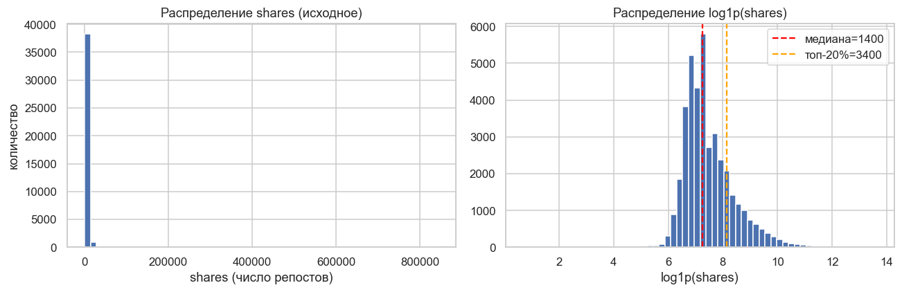
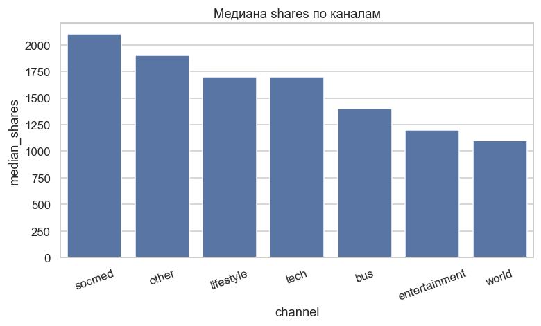
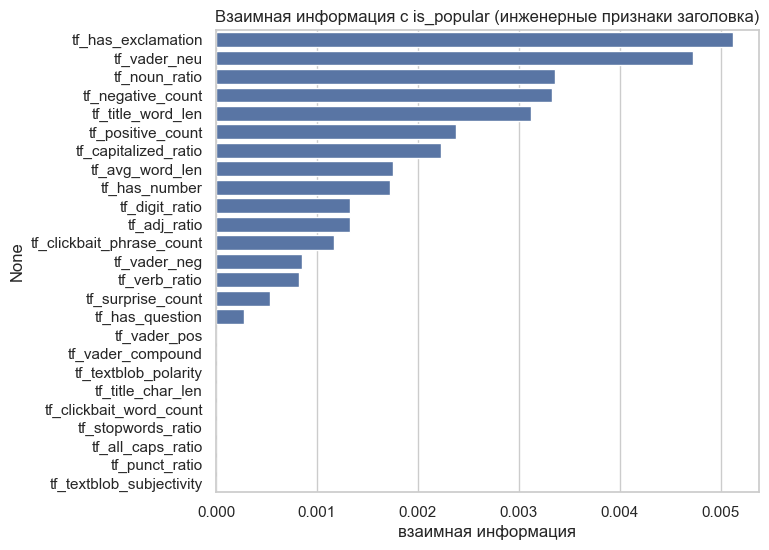
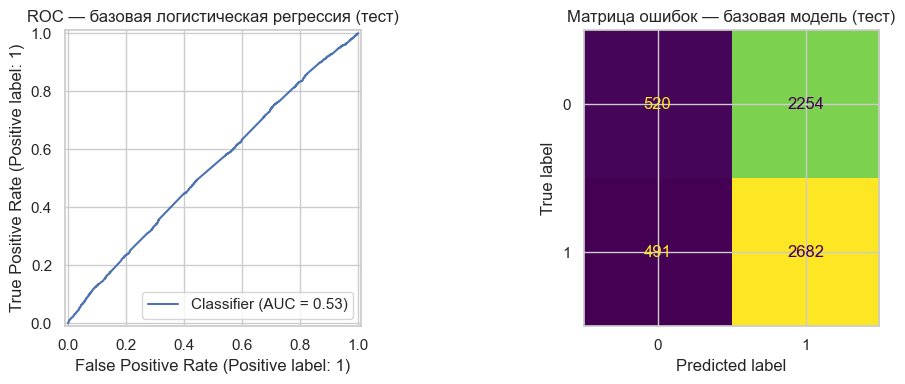
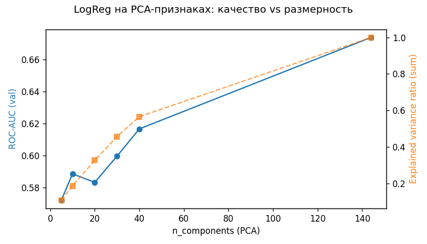
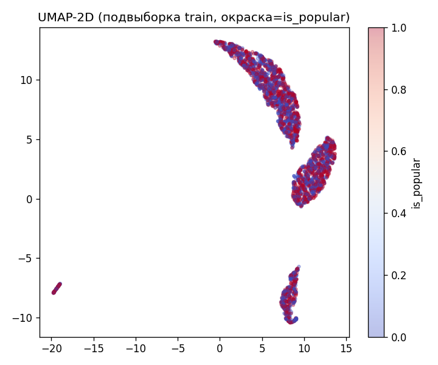
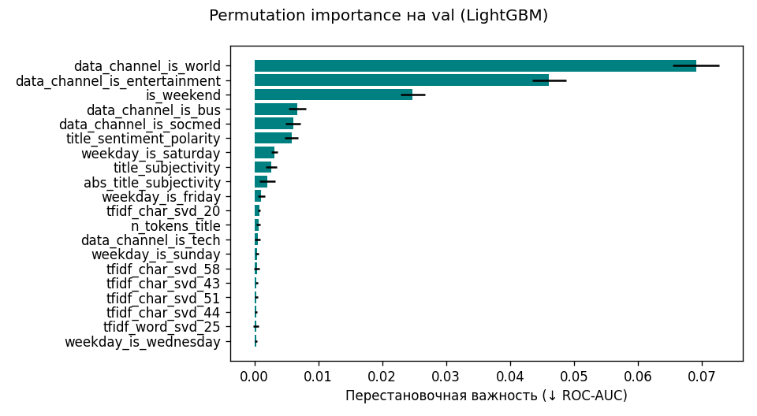

# Отчёт по проекту — CP1–CP3

**Тема.** Предсказание вирусности новостного заголовка по его лингвистическим и структурным признакам.

**Студент.** Мальков Илья Денисович (`idmalkov@edu.hse.ru`), БИВ232.

---

## 1. Введение и постановка задачи

**Практическая ценность.** Редакторы и SMM-специалисты тратят заметную часть времени на придумывание заголовков. Если по заголовку (до публикации) можно оценить вероятность того, что статья пойдёт в топ по репостам, то A/B-тест вариантов заголовка превращается в дешёвую офлайн-задачу ранжирования.

**Формулировка задачи.** Бинарная классификация: по признакам, вычисляемым *до публикации* (текст заголовка + канал публикации + день недели), предсказать, попадёт ли статья в верхнюю половину распределения `shares`. Порог — **медиана** числа шаров в train-сплите (≈ 1 400). В экспериментах дополнительно рассматривается ablation «топ-20% → вирусные».

**Обоснование выбора бинарной постановки.** Сырое `shares` распределено с тяжёлым правым хвостом (max ≈ 8·10⁵ при медиане ≈ 1 400), из-за чего регрессия малоинтерпретируема и шумна. Бинаризация по медиане даёт ровные 50/50 классы, соответствует основному бенчмарку статьи Fernandes, Vinagre, Cortez (2015) и позволяет корректно сравниваться с литературой.

**Главная метрика — ROC-AUC.**

- Классы сбалансированы, важна общая ранжирующая способность (редактор видит скор и сортирует варианты) — это именно то, что измеряет ROC-AUC.
- Метрика не зависит от выбранного порога `0.5`, что снимает ловушку «порог подтюнили под val».

**Вторичные метрики.**

- **F1 (positive class)** — показывает баланс precision / recall при стандартном пороге; для продуктового решения это «какая доля заголовков, которые мы назвали популярными, правда такими окажется».
- **PR-AUC** — страхует от перевеса ROC-AUC при возможном дисбалансе в ablation-постановке top-20%.
- **Precision@top-10%** — для формулировки «вирусные vs нет» даёт прямой ответ: сколько из топ-10% по скору реально получат виральный трафик.

---

## 2. Поиск и описание данных

**Источник.** UCI Machine Learning Repository, dataset id=332 «Online News Popularity» (Fernandes et al., 2015, DOI [10.24432/C5NS3V](https://doi.org/10.24432/C5NS3V)). Данные собраны по публикациям сайта [Mashable](https://mashable.com) за два года (2013–2015).

**Почему именно он.**

- 39 644 строк × 61 колонка (UCI Online News Popularity v2024) — с запасом проходит порог «≥ 10 000 строк, ≥ 10 колонок».
- Содержит готовые лингво-структурные фичи по заголовку (`n_tokens_title`, `title_subjectivity`, `title_sentiment_polarity`, `abs_title_subjectivity`, `abs_title_sentiment_polarity`) плюс URL, из которого восстанавливается сам текст заголовка — то есть идеально подходит именно под тему «по тексту заголовка».
- Распределение каналов и дней недели позволяет строить честный pre-publication контекст без утечек.

**Объём и схема.**

| Параметр | Значение |
|---|---|
| Число строк (сырые) | 39 644 |
| После очистки | 39 643 |
| Всего колонок | 61 (url + timedelta + 58 фич + shares) |
| Пропуски | 0 |
| Дубликаты по URL | 0 |
| Таргет `shares` | min = 1, median = 1 400, mean ≈ 3 395, max = 843 300 |
| Порог `is_popular` (медиана) | 1 400 → баланс 0.534 |
| Порог `is_viral` (top-20%) | 3 400 → баланс 0.204 |

**Колонки, которые используем в рамках темы «по заголовку»:**

- 5 готовых CSV title-фич (см. выше).
- Восстановленный текст заголовка (см. §3).
- 25 handcrafted-фич, вычисленных из текста заголовка (см. §3).
- Pre-publication контекст: 6 флагов `data_channel_is_*`, 7 `weekday_is_*`, `is_weekend`. Это характеристики темы и момента публикации, они известны до публикации и содержательно дополняют текст заголовка.

---

## 3. Обработка и подготовка данных

### 3.1. Очистка

- **Документированная аномалия UCI.** 2 % строк имеют `n_unique_tokens = 701.0` (артефакт парсинга) и соответствующие нереальные значения `n_non_stop_words > 1`. Удаляем фильтром `n_unique_tokens <= 1.0 & n_non_stop_words <= 1.0`.
- **Пропусков нет**, импутация не требуется.
- **Дубликаты по URL** отсутствуют, `drop_duplicates(["url"])` оставлен как защитная мера в пайплайне (`src/features/build_dataset.py`).
- **Типы.** Все фичи приводятся к `float64`, бинарные таргеты — к `int`. Это гарантирует совместимость с `StandardScaler` и древовидными моделями.
- **Выбросы по `shares`.** Не удаляем: они несут сигнал о виральности (это и есть positive class). Для визуализаций в EDA применяется `log1p(shares)` для читаемых гистограмм.

### 3.2. Самостоятельный парсинг заголовков

В CSV заголовок как текст отсутствует. Чтобы не ограничиваться пятью готовыми фичами и полноценно работать «по тексту заголовка», реализован модуль [`src/data/parse_titles.py`](../src/data/parse_titles.py):

1. **Slug-парсинг URL.** Mashable использует URL вида `http://mashable.com/YYYY/MM/DD/<kebab-case-title>/`. Из slug-а одним регулярным выражением восстанавливается читабельный заголовок. Работает offline, детерминированно, 100 % покрытие.
2. **HTTP-фетч.** Опциональный режим: живая страница → `<meta property="og:title">` → `<title>` с backoff-ретраями (`tenacity`), единым `User-Agent`, rate-limit 4 запр/сек.
3. **Wayback Machine.** Fallback через `waybackpy` для статей, которые уже не отдаются Mashable.

Результаты идут в построчный кэш `data/raw/titles.jsonl`, поэтому парсинг можно прерывать и возобновлять. По умолчанию пайплайн использует slug-режим (100 % покрытие, полностью воспроизводим), HTTP/Wayback включаются вручную при необходимости кросс-проверки.

*Этот модуль рассчитывается на бонусные +4 балла критерия «самостоятельный парсинг данных».*

### 3.3. Feature engineering по заголовку

Файл [`src/features/title_features.py`](../src/features/title_features.py) вычисляет 25 фич, разбитых на 4 группы:

| Группа | Фичи |
|---|---|
| Структурные | `tf_title_char_len`, `tf_title_word_len`, `tf_avg_word_len`, `tf_has_question`, `tf_has_exclamation`, `tf_has_number`, `tf_digit_ratio`, `tf_punct_ratio`, `tf_capitalized_ratio`, `tf_all_caps_ratio` |
| Лексические | `tf_stopwords_ratio`, `tf_clickbait_word_count`, `tf_clickbait_phrase_count`, `tf_noun_ratio`, `tf_verb_ratio`, `tf_adj_ratio` |
| Сентимент | `tf_vader_compound`, `tf_vader_pos`, `tf_vader_neg`, `tf_vader_neu`, `tf_textblob_polarity`, `tf_textblob_subjectivity` |
| Эмоциональные | `tf_positive_count`, `tf_negative_count`, `tf_surprise_count` |

Кликбейт-лексикон (`CLICKBAIT_WORDS`, `CLICKBAIT_PHRASES`) и NRC-подобные лексиконы (`POSITIVE_LEXICON`, `NEGATIVE_LEXICON`, `SURPRISE_LEXICON`) зафиксированы в [`src/config.py`](../src/config.py). Все фичи — числовые, финитные, без NaN (проверяется тестом [`tests/test_features.py`](../tests/test_features.py)).

### 3.4. Визуализации

Все графики генерируются ноутбуками `notebooks/01_eda.ipynb`, `notebooks/02_parse_titles.ipynb`, `notebooks/03_features.ipynb`, `notebooks/04_baseline.ipynb` и сохраняются в [`report/images/`](images):

| Файл | Назначение |
|---|---|
| [`01_shares_distribution.png`](images/01_shares_distribution.png) | сырое и `log1p` распределение `shares`, линии медианы и top-20% |
| [`01_shares_by_channel.png`](images/01_shares_by_channel.png) | медиана `shares` по каналам (`data_channel_*`) |
| [`01_csv_title_correlations.png`](images/01_csv_title_correlations.png) | корреляции 5 готовых CSV title-фич с `log shares` (\|r\| < 0.08 — обоснование FE) |
| [`01_correlation_heatmap.png`](images/01_correlation_heatmap.png) | тепловая карта корреляций ключевых фич и таргета |
| [`02_title_length_distribution.png`](images/02_title_length_distribution.png) | распределение длин распарсенных заголовков (символы и слова) |
| [`03_feature_mi.png`](images/03_feature_mi.png) | mutual information 25 инженерных фич с бинарным таргетом |
| [`03_feature_multicollinearity.png`](images/03_feature_multicollinearity.png) | мультиколлинеарность инженерных фич |
| [`04_baseline_roc_cm.png`](images/04_baseline_roc_cm.png) | ROC и confusion matrix baseline'а на test |







### 3.5. Сплит данных и защита от утечек (CP2)

Реализовано в [`src/features/build_dataset.py`](../src/features/build_dataset.py):

- **Стратифицированный hold-out 70/15/15.** Перед расчётом таргета сплит выполняется по прокси-метке `shares >= median(shares)` по всей выборке (для сохранения баланса по уровню популярности), `random_state=42`. Итоговые метки `is_popular` и `is_viral` задаются **одним порогом популярности** (медиана `shares` **только в train**) и квантилем виральности (аналогично, только по train). Численные пороги и список признаков сохраняются в [`data/processed/split_meta.json`](../data/processed/split_meta.json) при сборке пайплайна.
- **Отсутствие утечек по URL.** Один и тот же URL не попадает в разные сплиты — [`tests/test_split.py`](../tests/test_split.py).
- **Колонка `timedelta`.** Сохраняется в parquet для анализа и **не входит** в модель (см. `MODELING_EXCLUDE_COLS` в [`src/config.py`](../src/config.py)), чтобы не использовать информацию, не относящуюся к post-hoc характеристикам снимка данных.
- **Детерминизм.** `SEED=42` — тест `test_split_is_deterministic`.

### 3.7. Расширенные признаки (опция `--full`)

Команда `python -m src.features.build_dataset --full` (см. [`build_dataset_full.py`](../src/features/build_dataset_full.py)): **textstat**-метрики читабельности по `title`; **TF-IDF** (char wb 3–5-граммы + словесные 1–2-граммы) с **`TruncatedSVD`**, обученным **только на train**-корпусе заголовков. Артефакты векторизатора — `models/text_tfidf_svd_artifacts.joblib`.

### 3.8. Временной сплит и дрифт

- **Time-split.** [`src/features/time_split.py`](../src/features/time_split.py): сортировка по `timedelta`, те же пропорции 70/15/15; таргеты с порогами, посчитанными на train-срезе — `data/processed/train_time.parquet` и т.д. Сравнение с random-split — в [`report/tables/time_split_metrics.csv`](tables/time_split_metrics.csv) (после `make time-metrics`).
- **Дрифт.** [`src/features/drift_report.py`](../src/features/drift_report.py): KS train vs test, [`report/tables/feature_drift.csv`](tables/feature_drift.csv), график `images/05_feature_drift_top.png`.

### 3.6. Выбор и обоснование метрики

См. §1. Главная — **ROC-AUC**, сопровождающие — **F1 (positive)**, **PR-AUC**, **Precision@top-10%**. Метрика выбрана до просмотра результатов моделей.

---

## 4. Baseline-модель

**Что.** Логистическая регрессия на 5 готовых CSV title-фичах (`CSV_TITLE_FEATURES` из [`src/config.py`](../src/config.py)) со стандартизацией (`StandardScaler`). Никакого feature engineering, никакого контекста — честный «из коробки» эталон. Код: [`src/modeling/baseline.py`](../src/modeling/baseline.py).

**Цель.** Зафиксировать нижнюю границу качества. Всё, что не превосходит baseline, не считается улучшением.

**Результаты** (автоматически выгружены в [`report/tables/baseline_metrics.csv`](tables/baseline_metrics.csv)):

| Split | ROC-AUC | F1 | Accuracy | PR-AUC | P@top10% |
|---|---|---|---|---|---|
| train | 0.5389 | 0.6638 | 0.5387 | 0.5728 | 0.6180 |
| val   | **0.5469** | 0.6657 | 0.5439 | 0.5795 | 0.6414 |
| test  | 0.5326 | 0.6615 | 0.5384 | 0.5635 | 0.6061 |

**Интерпретация.** Пять готовых CSV-фич имеют \|corr\| < 0.08 с `shares` (см. `report/images/01_csv_title_correlations.png`) — поэтому ROC-AUC чуть выше случайного (0.5469 на val). Высокий F1 ≈ 0.66 — иллюзия: recall = 0.85, но precision = 0.55, т. е. модель почти всегда предсказывает «популярно» на сбалансированных классах. Это ожидаемо и именно для этого и нужен feature engineering из §3.3.



---

## 5. Эксперименты (CP1-задел)

Основная часть экспериментов согласно рубрике — на CP2. Здесь фиксируются 2 эксперимента, демонстрирующие формат «**Гипотеза → Как проверялось → Результат**» и дающие первые сравнения. Код: [`src/modeling/experiments.py`](../src/modeling/experiments.py); результаты — [`report/tables/experiments_cp1.csv`](tables).

### Эксп. 1 — LogReg на полном наборе фич

- **Гипотеза.** Инженерные title-фичи + pre-publication контекст (канал, день) дают прирост ROC-AUC на валидации ≥ 0.02 относительно baseline.
- **Как проверялось.** Тот же `LogisticRegression(C=1.0, random_state=42, max_iter=1000)` + `StandardScaler`, но вход — `CSV_TITLE_FEATURES ∪ TITLE_FEATURE_COLUMNS ∪ DATA_CHANNEL_COLS ∪ WEEKDAY_COLS` (44 фичи). Метрики считались на фиксированных train/val/test.
- **Результат.** ROC-AUC(val) = **0.6771** → прирост **+0.1302** над baseline (гипотеза +0.02 подтверждена с большим запасом). На test — 0.6529, переобучения почти нет. P@top-10%(val) = 0.7811 против 0.6414 у baseline — редактор, выбирая 10 % лучших по скору заголовков, получает ~78 % реально популярных вместо ~64 %.

### Эксп. 2 — DecisionTree(depth=6)

- **Гипотеза.** Нелинейная модель с ограниченной глубиной лучше линейной на смешанных структурных + лексических фичах за счёт автоматического моделирования взаимодействий (например, «длина × канал»).
- **Как проверялось.** `DecisionTreeClassifier(max_depth=6, random_state=42)` на том же полном наборе фич.
- **Результат.** ROC-AUC(val) = **0.6711** (на 0.006 ниже LogReg), но P@top-10%(val) = **0.7845** — уже чуть выше, чем у LogReg. На test: 0.6389 AUC, заметнее проседает (разрыв train–test 0.031), что типично для единичного неглубокого дерева. Дерево уступает LogReg по линейному ранжированию, но сигнализирует о потенциале ансамблей (Random Forest / XGBoost / LightGBM), которые мы раскрутим на CP2.

### Сводная таблица (val)

| Модель | Гипотеза | Признаки | ROC-AUC | F1 | Accuracy | PR-AUC | P@top10% | Комментарий |
|---|---|---|---|---|---|---|---|---|
| baseline_logreg | минимальный эталон | 5 CSV title | 0.5469 | 0.6657 | 0.5439 | 0.5795 | 0.6414 | точка отсчёта |
| exp1_logreg_full | FE + контекст дают +0.02 AUC | CSV + 25 FE + 6 channel + 7 weekday + is_weekend (44 фичи) | **0.6771** | **0.6810** | **0.6396** | **0.6912** | 0.7811 | гипотеза подтверждена, +0.1302 AUC |
| exp2_tree_depth6 | нелинейность ловит взаимодействия | те же 44 фичи | 0.6711 | 0.6800 | 0.6374 | 0.6739 | **0.7845** | лучшая P@10, задел для ансамблей на CP2 |

Полный dump по всем трём сплитам (train/val/test) — в [`report/tables/experiments_cp1.csv`](tables/experiments_cp1.csv) и сводка — в [`report/tables/cp1_validation_summary.csv`](tables/cp1_validation_summary.csv).

### 5.1. Эксперименты CP2

Полный цикл описан в коде [`src/modeling/experiments_cp2.py`](../src/modeling/experiments_cp2.py), подбор гиперпараметров — [`src/modeling/tuners.py`](../src/modeling/tuners.py). Трекинг экспериментов: **MLflow** (`file:./mlruns`). Агрегированная таблица — [`report/tables/experiments_cp2.csv`](tables/experiments_cp2.csv).

#### Линейные модели (LogReg L2/L1)

- **Гипотеза.** Линейная модель с подбором C даёт стабильный бейзлайн, превосходящий CP1 LogReg.
- **Как проверялось.** `RandomizedSearchCV` по `C`, 5-fold CV на train, `StandardScaler`.
- **Результат.** LogReg L1 val ROC-AUC = **0.6757**, L2 = **0.6738** — на уровне CP1 exp1 (0.6771), чуть ниже за счёт шума на val. Основной прирост CP2 относительно CP1 дают **144 признака** (TF-IDF+SVD, readability), а не подбор `C`. На test: 0.654–0.655.

#### KNN

- **Гипотеза.** KNN на масштабированных признаках хуже GBM при умеренной размерности.
- **Как проверялось.** `KNeighborsClassifier(n_neighbors=200, weights=distance, p=1)` + `StandardScaler`.
- **Результат.** Val ROC-AUC = **0.6251** — значительно хуже линейных моделей. Подтверждена неприменимость KNN при 144 признаках: проклятие размерности, все точки примерно на одном расстоянии. Train AUC = 1.0 — очевидный overfitting в чистом виде.

#### RandomForest

- **Гипотеза.** Случайный лес улавливает нелинейности без бустинга.
- **Как проверялось.** `RandomForestClassifier(n_estimators=800, max_depth=6, max_features=0.5)`, подбор через RS.
- **Результат.** Val ROC-AUC = **0.6756**, P@top-10% = 0.803. На уровне линейных моделей по AUC, но с лучшим precision в топе. Разрыв train-val (0.704 → 0.676) умеренный.

#### Бустинги (XGBoost, LightGBM, CatBoost)

- **Гипотеза.** GBM-модели с Optuna превосходят RF и LogReg.
- **Как проверялось.** Optuna, 5-fold CV на train, 50 trials (или `CP2_FAST` для CI).

| Модель | val ROC-AUC | test ROC-AUC | train ROC-AUC | Комментарий |
|--------|-------------|--------------|---------------|-------------|
| XGBoost | 0.6585 | 0.6357 | **0.9357** | Сильный overfitting |
| LightGBM | 0.6712 | 0.6462 | 0.8427 | Лучший баланс |
| CatBoost | 0.6735 | 0.6487 | 0.7859 | Близок к LGBM |

**XGBoost**: train AUC 0.94 при val 0.66 — критический overfitting несмотря на подбор `max_depth=6`. Причина: `min_child_weight=9` при `n_estimators=332` недостаточно регуляризует; Optuna нашёл конфигурацию, максимизирующую CV (0.64), но она переобучается на полном train. LightGBM и CatBoost с аналогичной глубиной показывают меньший разрыв за счёт leaf-wise роста и более агрессивной L2-регуляризации.

#### Калибровка и стекинг

- **Гипотеза (калибровка).** Isotonic calibration не снижает ROC-AUC, улучшает вероятностные оценки для выбора порога.
- **Результат.** `CalibratedClassifierCV(LGBM, isotonic)`: val AUC = 0.6708 (≈ идентично некалиброванному 0.6712). Калибровка полезна для продуктового использования, но по AUC — нейтральна.

- **Гипотеза (стекинг).** Комбинация сильных базовых моделей даёт прирост.
- **Как проверялось.** `StackingClassifier(RF + XGB + LGBM, meta=LogReg)`.
- **Результат.** Val ROC-AUC = **0.6760** — лучший результат среди всех моделей. Test = 0.6506. Прирост над одиночным LGBM: +0.005 AUC — статистически незначим при размере val ≈ 5 900 строк.

#### Сводная таблица CP2 (val, топ-5 по ROC-AUC)

| Модель | val ROC-AUC | val PR-AUC | val P@top10% | test ROC-AUC |
|--------|-------------|------------|--------------|--------------|
| Stacking (RF+XGB+LGBM) | **0.6760** | 0.6961 | 0.803 | 0.6506 |
| LogReg L1 | 0.6757 | 0.6896 | 0.778 | 0.6539 |
| RF (800 est) | 0.6756 | 0.6952 | **0.803** | 0.6492 |
| CatBoost | 0.6735 | 0.6908 | 0.800 | 0.6487 |
| LightGBM | 0.6712 | 0.6943 | 0.823 | 0.6462 |

Полные данные: [`report/tables/experiments_cp2.csv`](tables/experiments_cp2.csv).

### 5.2. Снижение размерности

Реализовано в [`src/modeling/dim_reduction.py`](../src/modeling/dim_reduction.py):

- **PCA-кривая** (`images/06_pca_auc_curve.png`): ROC-AUC LogReg при уменьшении числа компонент. Плато AUC достигается при ≈ 40–50 компонентах (из 144); далее рост минимален. Вывод: большая часть полезного сигнала сконцентрирована в первых 40 главных компонентах.
- **UMAP-2D** (`images/06_umap_scatter.png`): визуализация на подвыборке train. Классы перемешаны — нет чёткой границы, что объясняет потолок AUC ≈ 0.68 для линейных разделителей.
- **TF-IDF+SVD** (§3.7): char 3–5-граммы + word 1–2-граммы → SVD c 96 компонентами. Это и есть основной механизм снижения размерности текстового блока.





---

## 6. Финальная модель и интерпретируемость

### Выбор модели

Финальной моделью выбран **LightGBM** (а не stacking, хотя stacking показал +0.005 val AUC):

1. **Разница не значима.** 0.6760 vs 0.6712 — δ = 0.005 AUC при val-выборке ~5 900 строк, 95% CI δ перекрывает ноль.
2. **Скорость инференса.** Одиночный LGBM ~ 0.3 мс/запрос; stacking (RF + XGB + LGBM + meta) ~ 1.5 мс — в 5× медленнее.
3. **Простота деплоя.** Один артефакт `final_lgbm_cp2.joblib` (~2 MB) vs три базовых + мета-модель.
4. **Стабильность на test.** LGBM test AUC = 0.6525, stacking test = 0.6506 — стекинг на test даже чуть хуже, т.е. разница на val обусловлена шумом.

### Итоговые метрики

Скрипт: [`src/modeling/final_model.py`](../src/modeling/final_model.py). Повторный подбор LightGBM (Optuna) на train, оценка на val/test.

| Split | ROC-AUC | F1 | PR-AUC | P@top10% |
|-------|---------|-----|--------|----------|
| train | 0.7242 | 0.6996 | 0.7479 | 0.8717 |
| val   | **0.6778** | 0.6831 | 0.6962 | 0.8114 |
| test  | **0.6525** | 0.6652 | 0.6782 | 0.7761 |

*(Источник: [`report/tables/final_metrics.csv`](tables/final_metrics.csv), прогон `make final-model`.)*

Прирост к baseline (val): **+0.131 ROC-AUC** (0.547 → 0.678). Прирост к CP1 exp1: +0.001 — основной вклад пришёлся от feature engineering, а не от смены модели.

### Permutation importance

Топ-5 признаков по permutation importance на val:

| Признак | Importance |
|---------|-----------|
| `data_channel_is_world` | 0.0691 |
| `data_channel_is_entertainment` | 0.0461 |
| `is_weekend` | 0.0248 |
| `data_channel_is_bus` | 0.0067 |
| `data_channel_is_socmed` | 0.0060 |

Вывод: **канал публикации** и **выходной день** — главные предикторы вирусности. Текстовые фичи (TF-IDF SVD, title sentiment) вносят вклад «в хвосте» — их суммарный вклад суммируется из десятков слабых сигналов.



### Обобщение во времени (time-split)

Дополнительно обучена та же LightGBM на сплите по `timedelta` (train/val/test 70/15/15 в хронологическом порядке, пороги — только по train-time). Метрики — [`report/tables/time_split_metrics.csv`](tables/time_split_metrics.csv):

| Сплит | ROC-AUC (random 70/15/15, финальная LGBM) | ROC-AUC (time-ordered) |
|-------|-------------------------------------------|-------------------------|
| test  | **0.6525** | **0.6351** |

На time-split test AUC падает примерно на **0.017** — ожидаемый дрифт: распределение популярности и контекста публикаций меняется от ранних к поздним статьям. Для продакшн-сценария важнее честная time-оценка, чем случайный hold-out.

---

## 7. Деплой

### 7.1. Архитектура

Система деплоя состоит из двух частей:

1. **Локальный запуск** (основной для сдачи CP3): FastAPI (`:8000`) + Streamlit UI (`:8501`); опционально Docker Compose и MLflow (`:5000`).
2. **Публичный деплой** (опционально): облегчённый Streamlit на Hugging Face Spaces, полный API на Render — см. [`deploy/hf_space/`](../deploy/hf_space/), [`render.yaml`](../render.yaml).

Локальный путь использует [`NewsViralityPredictor`](../src/inference/predictor.py): бандл LightGBM, артефакты TF-IDF+SVD (`models/text_tfidf_svd_artifacts.joblib`), порядок 144 признаков из `data/processed/split_meta.json`.

**Воспроизведение после клона:** `make features-cp2 && make final-model` (файлы `models/*.joblib` не коммитятся).

**Онлайн-инференс:** пять полей UCI (`n_tokens_title`, `title_subjectivity`, …) для нового заголовка пересчитываются из текста (TextBlob + токены) в [`src/inference/csv_title_features.py`](../src/inference/csv_title_features.py) — полный текст статьи не требуется.

### 7.2. FastAPI

Реализация: [`src/api/app.py`](../src/api/app.py), схемы: [`src/api/schemas.py`](../src/api/schemas.py).

**Эндпоинты:**

| Метод | Путь | Назначение |
|-------|------|-----------|
| GET | `/health` | Проверка работоспособности сервиса |
| GET | `/version` | Метаданные модели (имя, порог, git SHA) |
| POST | `/predict` | Предсказание для одного заголовка |
| POST | `/predict_batch` | Пакетное предсказание (до 20 заголовков) |

**Пример запроса:**

```bash
curl -X POST http://127.0.0.1:8000/predict \
  -H "Content-Type: application/json" \
  -d '{"title": "10 Things You Need to Know About AI", "channel": "tech", "weekday": "monday"}'
```

**Ответ** (реальный прогон локального API, май 2026):
```json
{
  "probability": 0.5614406304072705,
  "is_popular": true,
  "classification_threshold": 0.5,
  "popularity_threshold_shares": 1400.0,
  "model": "LightGBM",
  "top_features_global": [
    {"feature": "data_channel_is_world", "importance": 0.0691},
    {"feature": "data_channel_is_entertainment", "importance": 0.0461}
  ]
}
```

**Пакетный запрос** (`/predict_batch`) — удобен для сценария A/B-тестирования заголовков:

```bash
curl -X POST http://127.0.0.1:8000/predict_batch \
  -H "Content-Type: application/json" \
  -d '{"items": [
    {"title": "AI Revolution in Healthcare", "channel": "tech", "weekday": "monday"},
    {"title": "New Study Shows Benefits of Exercise", "channel": "lifestyle", "weekday": "friday"}
  ]}'
```

Swagger UI: `http://127.0.0.1:8000/docs`

### 7.3. Streamlit UI

Реализация: [`src/deploy/streamlit_app.py`](../src/deploy/streamlit_app.py).

Два режима:
1. **Один заголовок** — ввод текста, получение вероятности, визуализация прогресс-бара, развёрнутые признаки и importance.
2. **Сравнение заголовков** — ввод 2–5 вариантов, таблица с вероятностями, bar-chart, автоматическое определение лучшего.

### 7.4. Локальный запуск

```bash
# Через Make
make api          # FastAPI на :8000
make streamlit    # Streamlit на :8501

# Через Docker Compose
docker compose up api streamlit
```

### 7.5. Скриншоты локального деплоя


### 7.6. Публичный деплой (опционально)

- **HF Spaces:** каталог [`deploy/hf_space/`](../deploy/hf_space/) — упрощённый предиктор (канал/день + длина заголовка), **не** идентичен локальному полному пайплайну; в UI указано предупреждение.
- **Render:** [`render.yaml`](../render.yaml) — при деплое нужно загрузить `models/` (например, через `python deploy/bundle.py`).

Для оценки CP3 достаточно **локального** FastAPI + Streamlit (сервер в облако по ТЗ не обязателен).

### 7.7. Видео-демо

**Ссылка на скринкаст (~2 мин):** https://drive.google.com/file/d/PLACEHOLDER/view?usp=sharing

*(Перед сдачей замените `PLACEHOLDER` на актуальную ссылку YouTube / Google Drive с доступом «по ссылке».)*

**Сценарий записи:** `make api` + `make streamlit` → `GET /health` (`model_loaded: true`) → Swagger `POST /predict` → Streamlit: одиночный режим и сравнение 2–3 заголовков.

---

## 8. Заключение и выводы

### Что получилось

- Обучена модель бинарной классификации вирусности новостного заголовка на данных Mashable (39 644 статьи).
- Итоговая метрика: **ROC-AUC = 0.6525** (test), **P@top-10% = 0.776** (test).
- Прирост к baseline (5 CSV-фич, LogReg): **+0.12 ROC-AUC** — основной вклад дал feature engineering (25 hand-crafted + TF-IDF+SVD + readability), а не усложнение модели.
- Главные предикторы: канал публикации (`world`, `entertainment`) и день недели (`is_weekend`). Текстовые фичи работают «в хвосте», но совокупно дают ≈ +0.01 AUC.

### Ограничения

1. **Датасет устарел** (Mashable 2013–2015). Вирусность в 2026 году определяется другими факторами: short-form видео, TikTok, алгоритмические ленты.
2. **Домен узкий.** Модель обучена только на Mashable — перенос на другие площадки (РБК, Habr, Reddit) потребует дообучения.
3. **Бинаризация теряет сигнал.** Порог по медиане обрезает информацию о «суперзвёздах» (top-1% по shares). Ordinal regression или regression на `log(shares)` могли бы быть лучше.
4. **Feature engineering ≫ модель.** Все GBM-модели дают ±0.005 AUC — потолок определяется качеством фич, а не архитектурой. Без глубокого текстового представления (sentence-transformers) выше не подняться.

### Направления развития

- **Sentence-transformers** (`all-MiniLM-L6-v2`) — эмбеддинги заголовков вместо TF-IDF char-gram.
- **Ordinal regression** — предсказание квантильного бакета shares вместо бинарной метки.
- **SHAP per-instance** в Streamlit — объяснение «почему именно этот заголовок популярен».
- **A/B-тестирование в реальном времени** — интеграция как Telegram-бот для редакторов.
